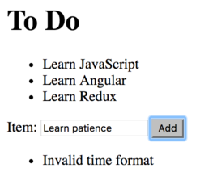
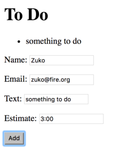

<!-- .slide: data-background="../images/title-slide.jpg" -->
<!-- .slide: id="reactive-forms" -->

## Building Applications with Angular

# Reactive Forms

---
<!-- .slide: id="reactive-forms-roadmap" -->
## Roadmap

1. How do reactive forms differ from template driven forms?
1. How do I create a reactive form?
1. How do I validate a reactive form?
1. How can I create my own validators?

---
<!-- .slide: id="reactive-forms-overview" -->
## Overview (again)

- Template Driven Forms: controls and validation rules defined in the template with directives
- Reactive Forms: controls and validation rules defined in the component class or service
  - Binding a form to a model
  - Also known as model driven forms
- Reactive forms can handle controls directly within the component
  - Push data to the controls and pull values as they change
- Do *not* use `ngModel` and `required` in the template
 - Define the validation and model as part of our component

---
<!-- .slide: id="reactive-forms-creating" -->
## Creating Reactive Forms

- Import `ReactiveFormsModule` from `@angular/forms` into `app.module.ts`

#####_src/app/app.module.ts_
```ts
import { FormsModule, ReactiveFormsModule } from '@angular/forms';

@NgModule({
  declarations: [
    // ...
  ],
  imports: [
    // ...
    ReactiveFormsModule
  ],
  providers: [],
  bootstrap: [AppComponent]
})
export class AppModule { }
```

---
<!-- .slide: id="reactive-forms-declaring-1" -->
## Declaring a Reactive Form

- Reactive Forms are declared using the `FormBuilder` service
- `FormControl` tracks the value, state and validity of a form control
- `FormGroup` tracks the group and validity state of a group of FormControls
- Use the `FormBuilder` service to create `FormGroup` and `FormControl` instances
- We will rebuild our `GenericInputComponent` to use these
  - Will get compilation errors until modifications complete

---
<!-- .slide: id="reactive-forms-declaring-2" -->
## Declaring a Reactive Form

#####_src/app/generic-input/generic-input.component.ts_
```ts
import { FormBuilder, FormGroup, FormControl } from '@angular/forms';

export class GenericInputComponent implements OnInit {

  @Output() newItem: EventEmitter<string> = new EventEmitter();
  textEntryForm: FormGroup;
  textEntryControl: FormControl;

  constructor(
    private builder: FormBuilder
  ) {
    this.textEntryControl = new FormControl('', []);
    this.textEntryForm = builder.group({
      textEntry: this.textEntryControl
    });
  }
}
```

---
<!-- .slide: id="reactive-forms-modifying-the-view" -->
## Modifying the View

```html
<form [formGroup]="textEntryForm" (ngSubmit)="addToDo()">
  <p>
    Item: <input [formControl]="textEntryControl">
    <button type="submit">Add</button>
  </p>
</form>
```

- Unlike template driven forms, we do not use `required` or `ngModel`
- Also not creating any template variables

---
<!-- .slide: id="reactive-forms-validating-1" -->
## Validating Reactive Forms

- Angular provides `required`, `maxLength`, `minLength`, and `pattern` validators
- Validators produce errors which can be checked by calling `hasError` on the `FormControl`

#####_src/app/generic-input/generic-input.components.ts_
```ts
import { FormBuilder, FormGroup, FormControl, Validators } from '@angular/forms';

export class GenericInputComponent {
  constructor(...) {
    this.textEntryControl = new FormControl('', [Validators.minLength(5)]);
    // ...
  }
}
```

---
<!-- .slide: id="reactive-forms-validating-2" -->
## Validating Reactive Forms

- Now use the validator in the form's HTML

```html
<ul [hidden]="textEntryControl.valid || textEntryControl.untouched">
  <li [hidden]="!textEntryControl.hasError('minlength')">
    Item must have at least five characters
  </li>
</ul>
```

<!-- preview: https://plnkr.co/edit/m8cTaN?p=preview -->

---
<!-- .slide: id="reactive-forms-custom-validators-1" -->
## Custom Validators

- Can also provide custom validators to `FormControl` that return:
  - `null` if the field is valid
  - `{ validatorName: true }` if it is not

#####_src/app/generic-input.component.ts_
```ts
import { FormControl } from '@angular/form';

export class CustomValidators {
  static timeFormat(ctrl: FormControl) {
    const pattern: RegExp = /\d\d:\d\d/;
    return pattern.test(ctrl.value) ? null : {timeFormat: true};
  }
}
```

- Note: validators can also be defined as plain functions
- And we really ought to put our validators in their own files...

---
<!-- .slide: id="reactive-forms-custom-validators-2" -->
## Custom Validators

- Validate a field by adding `timeFormat.hasError('timeFormat')` to the `FormControl` constructor

```ts
@Component({ ... })
export class GenericInputComponent {
  constructor(...) {
    this.textEntryControl = new FormControl('', [ CustomValidators.timeFormat ]);
    // ...
  }
}
```

- And display an error message

```html
<li [hidden]="!textEntry.hasError('timeFormat')">
  Invalid time format
</li>
```

---
<!-- .slide: id="reactive-forms-custom-validators-3" -->
## Custom Validators



<!-- preview: https://plnkr.co/edit/m6heM7?p=preview -->

---
<!-- .slide: id="reactive-forms-separating-forms-into-logical-sections" -->
## Separating Forms into Logical Sections

- Dividing large forms into sections makes it easier to track validation issues
  - Allows us to query individual groups to narrow down invalid controls
- Also useful for creating a form from a schema
- To group the sections, we need to use `FormGroup`
  - Which means using reactive forms
- We can create nested `FormGroup`s within other `FormGroup`s

---
<!-- .slide: id="reactive-forms-start-with-a-model" -->
## Start With a Model

- We want to turn this data structure into an Angular form

```ts
{
  "responsible": {
    "name": "Zuko",
    "email": "zuko@fire.org"
  },
  "task": {
    "text": "...",
    "estimate": "3:00"
  }
}
```

---
<!-- .slide: id="reactive-forms-converting-to-code" -->
## Converting to Code

- Turn the logical structure into a class
- Create a new component for this using `ng generate component structuredForm`
- Add variables to represent the parts of the form

#####_src/app/structured-form/structured-form.component.ts_
```ts
export class StructuredFormComponent implements OnInit {
  mainForm: FormGroup;

  responsible: FormGroup;
  name: FormControl;
  email: FormControl;

  task: FormGroup;
  text: FormControl;
  estimate: FormControl;
}
```

---
<!-- .slide: id="reactive-forms-building-the-form-1" -->
## Building the Form

- Inject `FormBuilder` via our constructor

#####_src/app/structured-form/structured-form.component.ts_
```ts
export class StructuredFormComponent implements OnInit {
  // ...as before...

constructor(
    private builder: FormBuilder
  ) {
  }
}
```

---
<!-- .slide: id="reactive-forms-building-the-form-2" -->
## Building the Form

- Use helper methods to create each form group's controls

#####_src/app/structured-form/structured-form.component.ts_
```ts
export class StructuredFormComponent implements OnInit {
  // ...as before...

  createResponsibleFormFields() {
    this.name = new FormControl('Zuko', [Validators.required]);
    this.email = new FormControl('zuko@fire.org', [Validators.required]);

    this.responsible = this.builder.group({
      name: this.name,
      email: this.email
    });
  }
}
```

- The other group is built the same way

---
<!-- .slide: id="reactive-forms-building-the-form-3" -->
## Building the Form

- Add the sub-groups to the main form once they have been created

#####_src/app/structured-form/structured-form.component.ts_
```ts
export class StructuredFormComponent implements OnInit {

  constructor(
    private builder: FormBuilder
  ) {
    this.createResponsibleFormFields();
    this.createTaskFormFields();

    this.mainForm = this.builder.group({
      responsible: this.responsible,
      task: this.task
    });
  }
}
```

<!-- preview: http://plnkr.co/edit/rJ576V7ncL0Fjm3T7zpt?p=preview -->

---
<!-- .slide: id="reactive-forms-using-the-form" -->
## Using the Form

#####_src/app/structured-form/structured-form.html_
```html
<form [formGroup]="mainForm">

  <div class="panel panel-default" formGroupName="responsible">
    <p>
      Name:
      <input class="form-control" type="text" name="name" id="name" [formControl]="name">
    </p>
    <p>
      Email:
      <input class="form-control" type="input" name="email" id="email" [formControl]="email">
    </p>
  </div>

  ...task form group goes here...

  <button type="submit" (click)="addToDo()">Add</button>
</form>
```

---
<!-- .slide: id="reactive-forms-wire-it-up" -->
## Wire It Up

- Throw away most of the data for now...

#####_src/app/structured-form/structured-form.component.ts_
```ts
export class StructuredFormComponent implements OnInit {

  @Output() newItem: EventEmitter<string> = new EventEmitter();

  addToDo() {
    this.newItem.emit(this.text.value);
  }
}
```

#####_src/app/app.component.html_
```html
<h1>{{title}}</h1>
<app-to-do-list [thingsToDo]="thingsToDo"></app-to-do-list>
<app-structured-form (newItem)="onNewItem($event)"></app-structured-form>
```

---
<!-- .slide: id="reactive-forms-appearance" -->
## Appearance



---
<!-- .slide: id="reactive-forms-shortcuts" -->
## Shortcuts

- Our component can also use shortcuts to create a `FormControl`

```ts
createResponsibleFormFields() {
  this.responsible = this.builder.group({
    name: new FormControl('Zuko', [Validators.required]),
    email: new FormControl('zuko@fire.org', [Validators.required])
  });
}
```
