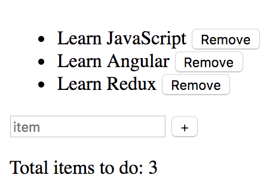

<!-- .slide: id="two-way-data-binding" -->
## Two-Way Data Binding

- Combination of an `@Input` with an `@Output` using the *banana in a box* syntax `[(event)]`
- The name of the event has to be equal to the name of the input plus the suffix "Change".

```html
<app-to-do-list [thingsToDo]="thingsToDo" (thingsToDoChange)="thingsToDo=$event"></app-to-do-list>
```

Is equivalent to:

```html
<app-to-do-list [(thingsToDo)]="thingsToDo"></app-to-do-list>
```

The built-in directive `NgModel` uses this trick to behave similar to Angular 1:

```html
<input [(ngModel)]="name" />
```

Equivalent:

```html
<input [ngModel]="name" (ngModelChange)="name=$event" />
```

---
<!-- .slide: id="two-way-data-binding-example-1" -->
## Two-Way Data Binding Example

- Let's add a remove button to demonstrate two-way data binding

#####_src/app/to-do-list/to-do-list.component.html_
```html
<ul>
  <li *ngFor="let item of thingsToDo; let i = index" id="{{i}}">
    {{item}}
    <button (click)="onComplete(i)">Remove</button>
  </li>
</ul>
```



---
<!-- .slide: id="two-way-data-binding-example-2" -->
## Two-Way Data Binding Example

- Import `Input`, `Output` from `@angular/core`
  - Add the necessary variables as well as the `onComplete` function
- `this.thingsToDoChange.emit(thingsToDo)` will now automatically update the `thingsToDo` variable in the `AppComponent`

#####_src/app/to-do-list/to-do-list.component.ts_
```ts
import { Component, Input, Output, EventEmitter } from '@angular/core';
//... other code omitted for readability
export class ToDoListComponent {

  @Input() thingsToDo: string[] = [];
  @Output() thingsToDoChange: EventEmitter<string[]> = new EventEmitter();
  
  onComplete(index) {
    const thingsToDo = this.thingsToDo.filter((item, idx) => idx !== index);
    this.thingsToDoChange.emit(thingsToDo);
  }
}
```

---
<!-- .slide: id="two-way-data-binding-example-3" -->
## Two-Way Data Binding Example

- The parent component can use now the *banana in a box* syntax

```html
<app-to-do-list [(thingsToDo)]="thingsToDo"></app-to-do-list>
<app-generic-input (newItem)="onNewItem($event)"></app-generic-input>

Total items to do: {{ thingsToDo.length }}
```

---
<!-- .slide: data-background="../images/question-slide.jpg" -->
<!-- .slide: id="two-way-data-binding-quiz-1" -->
## Quiz

Choose all of the following that are needed to make two-way data binding work.

1. `@Input` decorator
2. `@Output` decorator
3. `[]` attribute (as in `[hello]="hello!"`)
4. `()`attribute (as in `(click)=sayHi()`)

+++
<!-- .slide: data-background="../images/answer-slide.jpg" -->
<!-- .slide: id="two-way-data-binding-answer-1" -->
## Answer

Selecting ALL of them is correct.

If the student picks either 3 or 4, it could be that the student forgot that
the "banana in a box" syntax `[()]` is in fact combination of `[]` and `()`

---

<!-- .slide: data-background="../images/question-slide.jpg" -->
<!-- .slide: id="two-way-data-binding-quiz-2" -->
## Quiz

Q: What is the shorthand form of `<counter [count]="parentCount" (countChange)="parentCount = $event">` ?

1. `<counter [count]="parentCount">`
2. `<counter (count)="parentCount()">`
3. `<counter ([count])="parentCount">`
4. `<counter [(count)]="parentCount">`

+++
<!-- .slide: data-background="../images/answer-slide.jpg" -->
<!-- .slide: id="two-way-data-binding-answer-2" -->
## Answer

Correct answer is 4. 

1. The student might be confusing this with the `@Input()` decorator
2. The student might be confusing this with the `@Output()` decorator
3. The syntax is wrong

---