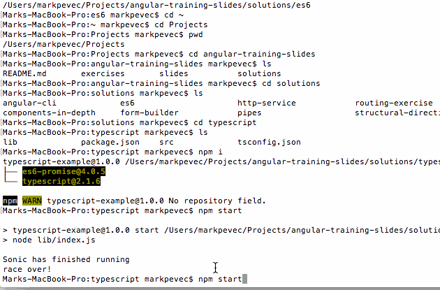

# Typescript Exercise

An exercise to create a small node app written in typescript and compiled into javascript



## Step 1

Create a new folder called `typescript` inside of the `training` folder. Run `npm init` in the `typescript` folder to initialize a new npm package.

## Step 2

In the `typescript` folder:
- install `typescript` using the `npm install --save typescript` command
- install `es6-promise` using the `npm install --save es6-promise` command

## Step 3

Create a `tsconfig.json` file in the `typescript` folder and include the following in it
```json
{
    "compilerOptions": {
        "target": "es5",
        "module": "commonjs",
        "declaration": false,
        "noImplicitAny": false,
        "noLib": false,
        "outDir": "./lib"
    },
    "filesGlob": [
        "./**/*.ts",
        "!./node_modules/**/*.ts"
    ],
    "files": [
        "./src/index.ts",
        "./src/hedgehogs.ts",
        "./node_modules/es6-promise/es6-promise.d.ts"
    ]
}
```

## Step 4

Add `"build": "tsc"` and `"start": "node lib/index.js"` to the `scripts` property of your
`package.json` file.

## Step 5

In the `typescript` folder create a `src` folder and inside it a file `index.ts` and a file `hedgehogs.ts`.

## Step 6

Import `Promise` from `es6-promise`into `hedgehog.ts` and `index.ts`

```ts
import {Promise} from 'es6-promise';
```

## Step 7

In the `hedgehogs.ts` file, create a class called `Hedgehog` and another class called `Sonic`. `Sonic` should extend `Hedgehog`. `Hedgehog` should have properties for `color` and `weight` typed `string` and `number` respectively. `Sonic` should inherit those and also have a `rings` property typed `number`. Create appropriate constructors for each, taking intializers for all their properties.

## Step 8

Add a method to both classes called `run`. For the `Hedgehog` the `run` method should return a Promise that resolves after 3 seconds. For `Sonic` the `run` method should return a Promise that resolves after 0.5 seconds. Use only arrow function syntax within walk.

## Step 9

In `index.ts` instantiate a `Hedgehog` and a `Sonic` object using arguments of the wrong
type in the constructors. Run `npm run build` and note the errors.

## Step 10

Fix the incorrect types you passed into the `Hedgehog` and `Sonic` constructors then
use pass `hedgehog.run()` and `sonic.run()` into `Promise.race()` to see which Promise
resolves first

## Step 11

run `npm run build` then `npm run start`
